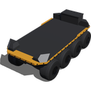
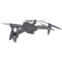
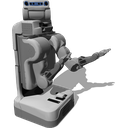
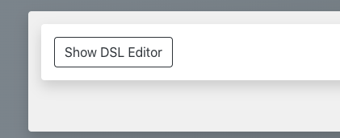
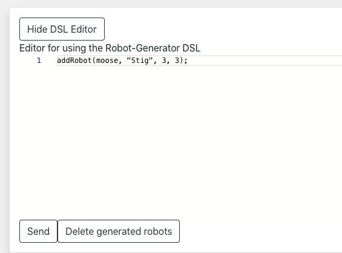

# Documentation for using the Robot-Generator DSL

## Installation
To install the Robot-Generator DSL, follow the instructions in *Wirom2.0/Documentation/UPDATED_SETUP.md*


## Understanding the grammar
The idea behind the design of the grammar is to resemble function calls in a "generic" programming language. All you have to do is write a command on the form: 

```javascript
functionCall(robotType, "robotName", xValue, yValue);
```


### Available function calls:
- **addRobot** --> Currently the only one utilized
- **removeRobot** --> Included, but not utilized


### Available Robots
| *Robot type*  |                *Image*                |
| :-----------: | :-----------------------------------: |
|   **moose**   |      |
| **mavic2pro** |  |
|    **op2**    |        |
|    **bb8**    |        |
|    **pr2**    |        |


### xValue and yValue
These can be arbitrary, as they are currently not used when the robots are integrated into the Webots World.

### Correct usage
The following lines includes some valid usages of the language

```javascript
addRobot(moose, "MooseName", 3, 3);
addRobot(mavic2pro, "Mavic2ProName", 334, 32134);
```

```javascript
addRobot(bb8, "R2D2", 1, 1);
```
```javascript
addRobot(moose, "Stig", 12,1);
```

### *Incorrect* usage
```javascript
addrobot(bb8, "R2D2", 1, 1); // Full lowercase function name
```
```javascript
addRobot(bb8, "R2D2", 1,); // Missing last argument
```
```javascript
addRobot(mose, "Stig", 1, 3); // Invalid robot type
```
```javascript
addRobot(bb8, "R2D2", 1,); // Missing last argument
```

## How to run the editor
There are two ways for the users to utilize the robot-generator DSL in Wirom2.0, either by using it through the generic editor provided in the user interface or by using the VS Code extension editor. The first option provides an easier user experience, by not having to navigate the project structure and running the necessary commands. However, the second option provides much more editor features and instant feedback. 

### Using the web interface editor (recommended)
When using the editor provided in the web interface, you get the advantage of having the generated changes automatically integrated into the rest of the system. \
To open the editor, press the button *Show Algorithm Editor*: \

 \

Enter a valid command, and press *Send*: \

 \

A status message is displayed under the editor, with either a success message displaying generated file path or an error message. \
After sending the editor content and generating the new robots, you need to reload the world file in Webots. This is done by clicking the *reload* button on the top toolbar in Webots, to the left of the time stamps:


 